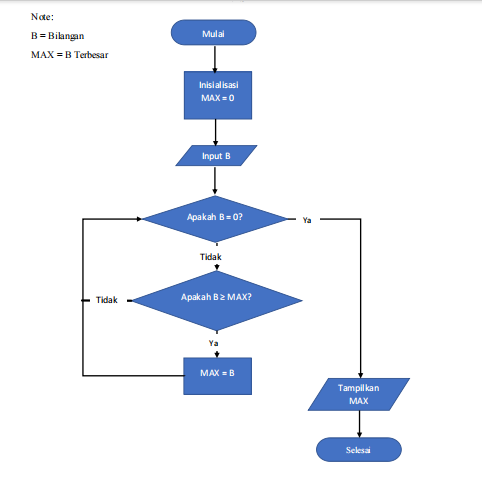
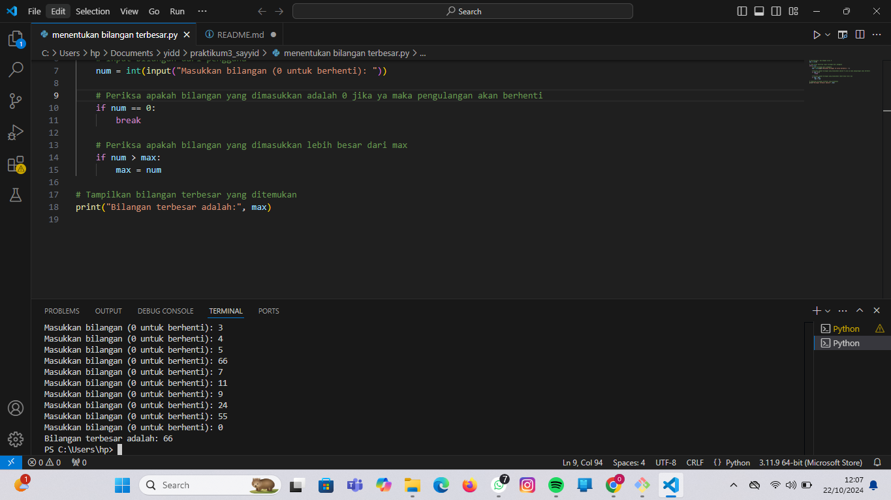
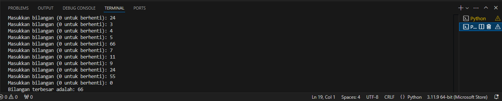

# praktikum3_sayyid
## menentukan bilangan terbesar dari N bilangan yang di inputkan, unuk menentukan jumlah N masukan angka 0

### flowchart
ini dalam bentuk flowchart 

### program python
seperti ini jika dalam bentuk program python 

### hasil eksekusi program

